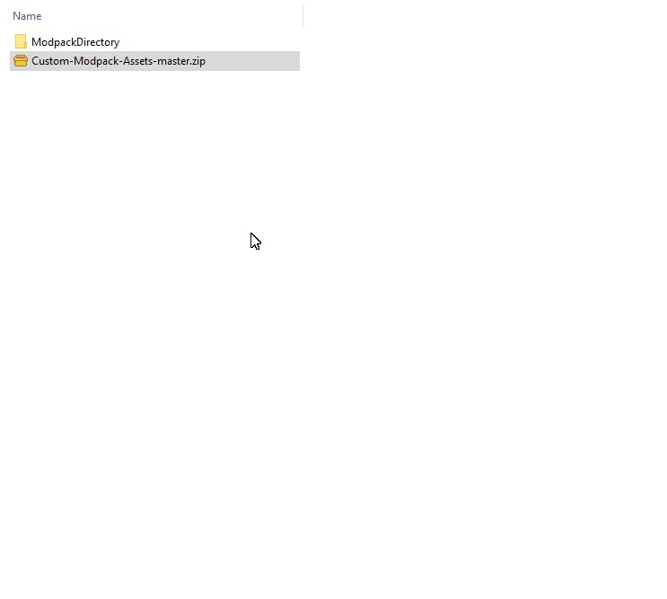

<h1 align="center">
  <br>
  <a href="https://github.com/ROMVoid95/Custom-Modpack-Assets/archive/master.zip"></a>
</h1>

<h4 align="center">Custom Assets To Use In Any Modpack</h4>

<p align="center">
    <a href="https://github.com/ROMVoid95/Custom-Modpack-Assets/commits/master">
    
    <a href="https://github.com/ROMVoid95/Custom-Modpack-Assets/blob/master/LICENSE">
    
    <a href="https://github.com/ROMVoid95/Custom-Modpack-Assets/archive/0.0.1.zip">
    
    <a href="">
    
</p>
      
<p align="center">
  <a href="#mods-needed">Mods Needed</a> •
  <a href="#usage-example">Usage example</a> •
  <a href="#how-to-add-to-your-modpack">How To Add To Your Modpack</a> •
  <a href="#file-extensions">File Extensions</a> •
  <a href="#release-history">Release History</a> •
  <a href="#license">License</a>
</p>

---


## Mods Needed
The assets in this repository are used with the following mods
```sh
- Custom Main Menu 
- Custom Loading Screen	
```

## Usage example

The repository's folder structure:
```bash
├───<MODPACK_NAME>
│   ├───config
│   │   ├───<folder_name>
│   │	│	└───<filename>.cfg
│   │   └───<filename>.cfg
│   │
│   └───resources
│       ├───<folder_name>
│       │   └───<filename>.png
│       └───(...)
│	   └───(...)
```
**(...)** means more folders or files may be present, this is meant to show the basic structure of the 
directories for people that may not be aware of how they work.

---
## How To Add To Your Modpack
**One** Download the Repository (or fork it)

**Two** Unzip The .zip folder after download is complete

**Three** Copy folders / or wanted content

**Four** Paste into your modpacks directory (overwrite only if you dont want your old files)




As you can see, this is where the folders in each modpack are located 
(all other folders in the picture may or not be present in your modpack)

---

## File Extensions
   file extensions may be different for certain files.

**<*filename*>.cfg** 

>.cfg may be *.json .ini .properties*

**<*filename*>.png** 

>.png may be *.jpg or even .psd* <- very uncommon, normally is *.png

## Release History

* 0.0.1
    * Initial Upload

## License

[](http://badges.mit-license.org)

- **[MIT license](http://opensource.org/licenses/mit-license.php)**
- Copyright 2019 © ROMVoid
