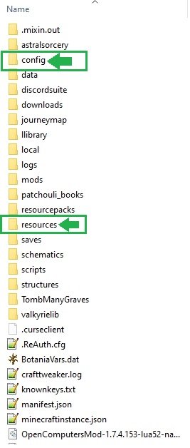

# Custom Modpack Assets
> This is my collection of customized material used in Modpacks i have developed/co-developed

## Mod Assets
> The assets in this repository are used with the following mods
```sh
- Custom Main Menu 
- Custom Loading Screen	
```

## Usage example

The repository's folder structure:
```bash
├───<MODPACK_NAME>
│   ├───config
│   │   ├───<folder_name>
│   │	│	└───<filename>.cfg
│   │   └───<filename>.cfg
│   │
│   └───resources
│       ├───<folder_name>
│       │   └───<filename>.png
│       └───(...)
│	   └───(...)
```
**(...)** means more folders or files may be present, this is meant to show the basic structure of the 
directories for people that may not be aware of how they work.

---
## Wait What?
The folder structure is meant to show the exact location of the folders/files as they appear in the root
directory of the minecraft instance. 

*for example*
The following is the root directory of the Enigmatica 2 Expert modpack



As you can see, this is where the folders in each modpack are located 
(all other folders in the picture may or not be present in your modpack)

---
## File Extensions
   file extensions may be different for certain files.

**<*filename*>.cfg** 

>.cfg may be *.json .ini .properties*

**<*filename*>.png** 

>.png may be *.jpg or even .psd* <- very uncommon, normally is *.png

## Release History

* 0.0.1
    * Initial Upload

## License

Distributed under the MIT license. See ``LICENSE`` for more information.

Feel free to contact me if you find any issues with this README.
**Email:** 
